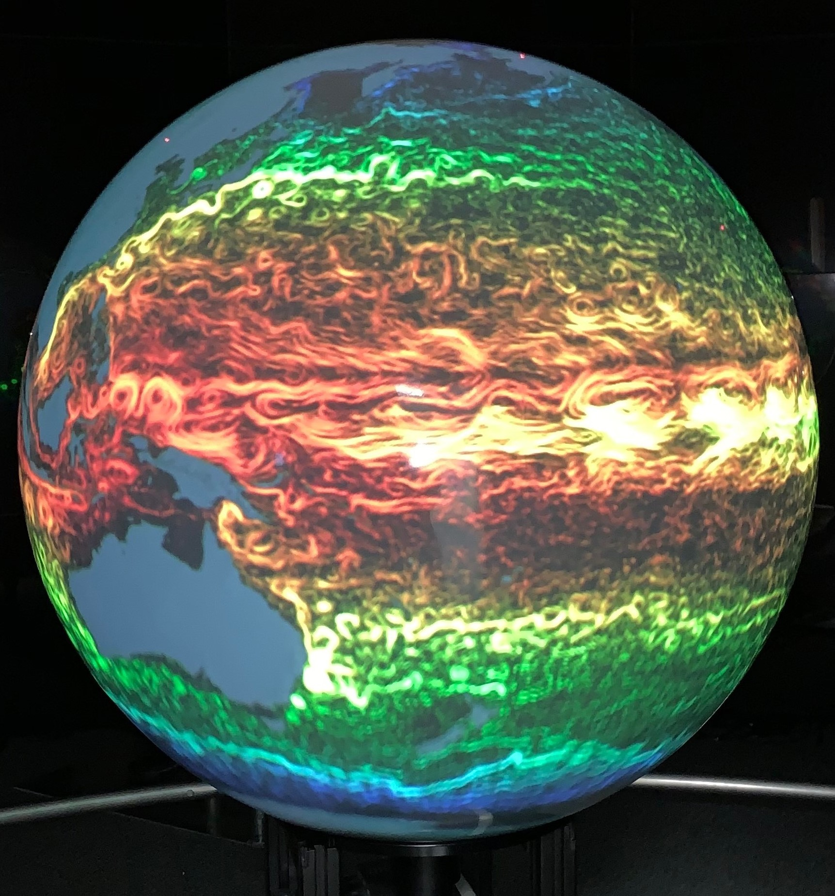

# What is MP/SOS? 

Magic Planet is a presentation system that uses a projector from below to display images or video on a spherical screen.

{height=400px}

Science on a Sphere is a similar system created by NOAA that uses multiple projectors to display video and images on a larger spherical screen than Magic Planet.

Both are commonly used to visualize earth systems and processes on a globe.

## How to Operate:

## Processing Software: 

 

