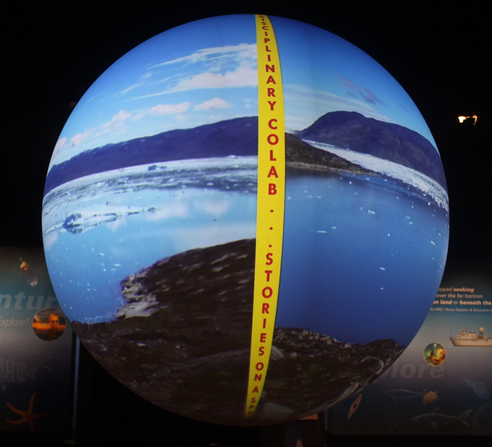

# Getting Ready (for making a Presentation)

## Basics of spherical presentations/content: 

When working with a spherical screen, it’s important to consider what kind of visuals (other than maps and 360 visuals) will work effectively, since most videos created for a flat screen will appear to be distorted on the spherical screen. The best visuals to use are those in which most of the content is condensed along a central horizon, so the focus of the visual will appear along the “equator” of the globe. Any objects too close to the top or bottom of an image will become increasingly distorted toward the poles of the sphere.

## Using AfterEffects / other software: 

We used AfterEffects to animate images, overlay pictures and videos onto a background image, and even to visualize what a certain visual will appear like on a sphere. 

We also created a seam cover in _ask Paul_. 

This is a personal choice. We also blurred some images in Photoshop to get rid of seams. 
