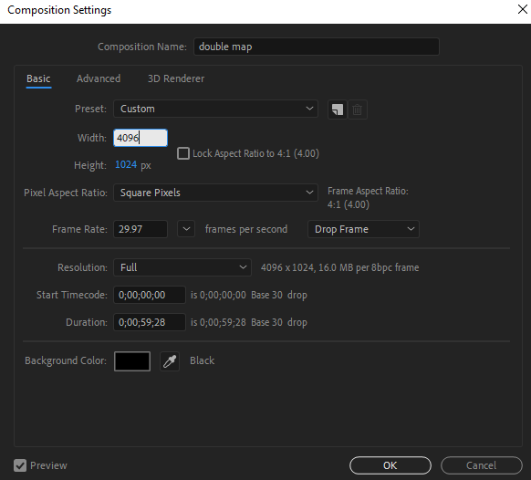

# Audio / Visual

We extensively used Adobe AfterEffects to rotate images and videos across the Magic Planet.

## Basics of Adobe AfterEffects 

A “composition” is kind of the name for a project, but it can be more than that. Basically, it’s a timeline where you assemble (“compose”) different media and effects together. You can have compositions inside of other compositions, which is useful for spherical presentations.

## General Parameters: 

* Dimensions: 2048x1024 (2:1 ratio for width:height)
  + If making something for NOAA SOS, you might want to make content in 4K (4096x2048)

* Framerate: 29.9--- 

## Making an Image/Video the Correct Dimensions 

